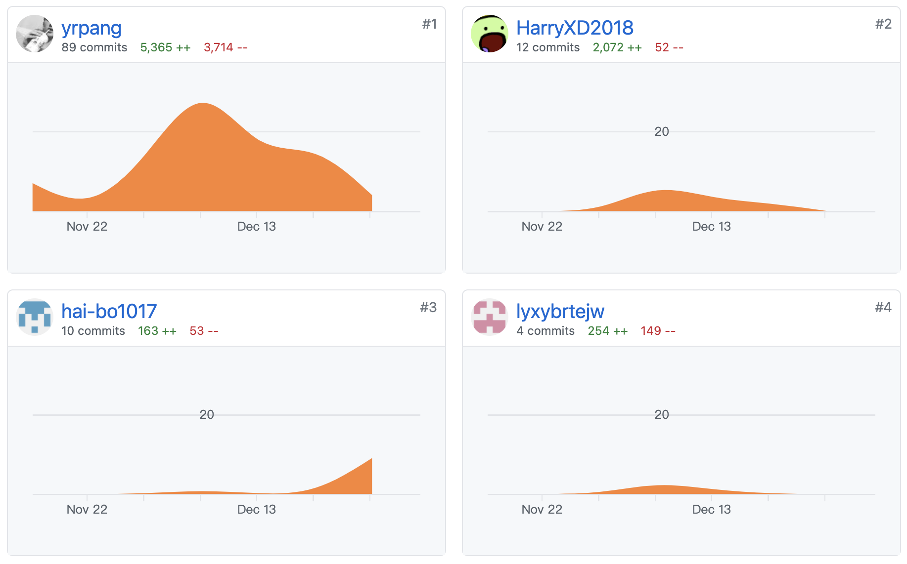

# 数据库大作业报告

**小组成员**：

|  姓名  |    学号     |
| :----: | :---------: |
| 庞义人 | 17130130255 |
| 陈禾嘉 | 18030400012 |
| 胡道汝 | 18030100184 |
|  唐坤  | 18030100240 |

## 1 任务要求

今要建立关于系、学生、班级、学会等诸信息的一个关系数据库。一个系有若干专业，每个专业每年只招一个班，每个班有若干学生。一个系的学生住在同一宿舍区。每个学生可参加若干学会，每个学会有若干学生。学生参加某学会有一个入会年份。描述各个实体的属性（加下划线者为实体标识符）如下：

- 学生：学号、姓名、年龄、系名、班号、宿舍区。
- 班级：班号、专业名、入校年份、系名、人数。
- 系：系号、系名、系办公室地点、人数。
- 学会：学会号、学会名、成立年份、地点。

## 2 整体架构设计及小组合作方案

系统整体定位为一个web项目，整体架构如下图1所示。

<center>
  
  <br>
  <div style="display: inline-block; color: #000; padding: 2px;">图1</div>
</center>


系统前端采用微信小程序，后端使用 `flask` 框架，数据库选用 `MySQL5.7` 。

前后端通过 `Restful API` 通信(具体接口设计见[5 前后端接口设计](#5 前后端接口设计) )，后端服务器使用腾讯云CVM，数据库服务器使用 `TencentDB` MySQL版，两者通过内网通信。

小组成员共同完成数据库设计，之后认领任务借助GitHub进行协作，共同完成各部分开发及文档撰写。

## 3 数据库设计

### 3.1 概念设计阶段

根据[1-任务要求](#1-任务要求)中的需求进行分析，得出系统中共包含四个实体，分别为：学生、班级、学会和系，根据实体间关系构建的ER图并进行优化，最终结果如下(图2)：

<center>
 
 <br>
 <div style="display: inline-block; color: #000; padding: 2px;">图2</div>
</center>


如上图2所示，班级与学生、系与班级的关系为 `1:n`（一对多），学会与学生的关系是多对多关系 `m:n`（多对多）。

### 3.2 逻辑结构设计

综合考虑任务需求和软硬件条件，我们选择关系数据模型作为逻辑结构，完成E-R图向关系模型的转化，最终建立如下关系模型：

- Student(stuNo, stuName, stuAge, classNo)
- Association(societyNo, societyName, societyYear, societyLoc)
- Class(classNo, className, classYear, classNum, departNo)
- Department(departNo, departName, departOffice, departNum, dormitoryNo)
- JoinStatus(stuNo, societyNo, joinYear)

**注:** 此处略去了中间的优化和调整过程直接呈现最终结果

### 3.3 数据模型优化

分析上述逻辑结构，得出各表的函数依赖如下：

$$
\begin{align}
&Student: \{stuNo \rightarrow stuName,\ stuNo \rightarrow stuAge,
stuNo \rightarrow classNo\}\\

\\&Society: \{societyNo \rightarrow societyName,\ societyNo \rightarrow societyYear,\ 
societyNo \rightarrow societyLoc\}\\

\\&Class: \{classNo \rightarrow className,\ classNo \rightarrow departNo,\ 
classNo \rightarrow classYear,\ 
(classYear, departNo) \rightarrow classNo\}\\

\\&Department:\{departNo \rightarrow departName,\ departName \rightarrow departNo,\ departNo \rightarrow departOffice,
\\&departNo \rightarrow dormitoryNo\}\\

\\&JoinStatus:\{(stuNo, societyNo) \rightarrow joinYear\}
\end{align}
$$

分析可知所有函数依赖的决定因素都含有码，直接判定满足BCNF。

## 4 系统实现

### 4.1 基本表的创建

根据逻辑结构设计结果，写SQL语句建立相应Table。

#### 4.1.1 Department表（对应系实体）

```SQL
CREATE TABLE Department(
  departNo INT PRIMARY KEY AUTO_INCREMENT,
  departName VARCHAR(20) NOT NULL,
  departOffice VARCHAR(40),
  departNum INT DEFAULT 0,
  dormitoryNo VARCHAR(20)
);
```

#### 4.1.2 Class表（对应班级实体）

```SQL
CREATE TABLE Class(
  classNo VARCHAR(10) PRIMARY KEY,
  className VARCHAR(40) NOT NULL,
  classYear SMALLINT NOT NULL,
  classNum INT DEFAULT 0,
  departNo INT NOT NULL,
  FOREIGN KEY(departNo) REFERENCES Department(departNo)
);
```

#### 4.1.3 Student表（对应学生实体）

```SQL
create TABLE Student(
  stuNo VARCHAR(11) PRIMARY KEY,
  stuName VARCHAR(20) NOT NULL,
  stuAge INT,
  classNo VARCHAR(10) NOT NULL,
  FOREIGN KEY(classNo) REFERENCES Class(classNo) ON UPDATE CASCADE
);
```

#### 4.1.4 Association表（对应学会实体）

```SQL
CREATE TABLE Association(
  societyNo INT AUTO_INCREMENT PRIMARY KEY,
  societyName VARCHAR(20) NOT NULL,
  societyYear SMALLINT,
  societyLoc VARCHAR(50)
);
```

#### 4.1.5 JoinStatus表（对应学生-学会关系）

```SQL
CREATE TABLE JoinStatus(
  stuNo VARCHAR(11) NOT NULL,
  societyNo INT NOT NULL,
  joinYear SMALLINT NOT NULL DEFAULT 2020,
  FOREIGN KEY(stuNo) REFERENCES Student(stuNo),
  FOREIGN KEY(societyNo) REFERENCES Association(societyNo)
);
```

### 4.2 建立视图 **(后端设计要求1)**

建立视图展示学会实体的学会名以及相应学生数量

```SQL
CREATE OR REPLACE VIEW NAME_SOCIETY AS
(
  SELECT Association.societyNo, Association.societyName Name, 
    COUNT(DISTINCT Student.stuNo) Num
  FROM Association 
    LEFT OUTER JOIN JoinStatus ON(Association.societyNo=JoinStatus.societyNo) 
    LEFT OUTER JOIN Student ON(JoinStatus.stuNo=Student.stuNo)
  GROUP BY societyNo
);
```

### 4.3建立触发器 **(后端设计要求2)**

根据每个班的学生变动情况自动增减班级表和系表的人数字段的值。

#### 4.3.1 INSERT触发增加学生数量

```SQL
DELIMITER $
CREATE TRIGGER UPSTUNUM
AFTER INSERT ON Student
FOR EACH ROW
BEGIN
  UPDATE Class SET classNum=classNum+1 WHERE classNo=NEW.classNo;
  UPDATE Department SET departNum=departNum+1 WHERE departNo IN (
    SELECT departNo FROM Class, Student WHERE Class.classNo=NEW.classNo
  );
END;
$
DELIMITER ;
```

#### 4.3.2 DELETE触发减少学生数量

```SQL
DELIMITER $
CREATE TRIGGER DECSTUNUM
AFTER DELETE ON Student
FOR EACH ROW
BEGIN
  UPDATE Class SET classNum=classNum-1 WHERE classNo=OLD.classNo;
  UPDATE Department SET departNum=departNum-1 WHERE departNo IN (
    SELECT departNo FROM Class, Student WHERE Class.classNo=OLD.classNo
  );
END;
$
DELIMITER ;
```

#### 4.3.3 UPDATE触发学生数量更新

```SQL
DELIMITER $
CREATE TRIGGER UPDATESTUNUM
AFTER UPDATE ON Student
FOR EACH ROW
BEGIN
  UPDATE Class SET classNum=classNum+1 WHERE classNo=NEW.classNo;
  UPDATE Department SET departNum=departNum+1 WHERE departNo IN (
    SELECT departNo FROM Class, Student WHERE Class.classNo=NEW.classNo
  );
  UPDATE Class SET classNum=classNum-1 WHERE classNo=OLD.classNo;
  UPDATE Department SET departNum=departNum-1 WHERE departNo IN (
    SELECT departNo FROM Class, Student WHERE Class.classNo=OLD.classNo
  );
END;
$
DELIMITER ;
```

### 4.4 建立函数 **(后端设计要求3)**

给定一个班的旧班号和新班号，把所有相关表中此班的旧班号改为新班号，并返回此班的人数。

```SQL
DELIMITER $
CREATE FUNCTION change_classNo(old_classNo VARCHAR(20), new_classNo VARCHAR(20))
RETURNS INT
BEGIN
  DECLARE num INT DEFAULT 0;

  UPDATE Class
  SET classNo=new_classNo
  WHERE classNo=old_classNo;

  UPDATE Student
  SET classNo=new_classNo
  WHERE classNo=old_classNo;

  SELECT COUNT(*) INTO num
  FROM Student
  WHERE classNo=new_classNo;

  RETURN(num);
END;
$
DELIMITER ;
```

### 4.5 建立存储过程 **(后端设计要求4)**

使用游标完成如下功能：确定系表中人数字段的值与实际学生数是否相符。如果不相符，把人数字段的值改为实际数，并返回此系的系号、系名、原人数、实际人数。

```SQL
DELIMITER $
CREATE PROCEDURE FIXNUM()
BEGIN
  DECLARE done INT DEFAULT FALSE;
  DECLARE id, num, real_num INT;
  DECLARE tmp_name VARCHAR(20);
  DECLARE cur CURSOR FOR SELECT departNo, departName, departNum FROM Department;
  DECLARE CONTINUE HANDLER FOR NOT FOUND SET done = TRUE;

  OPEN cur;

  DROP TABLE IF EXISTS tmp_table;
  CREATE TEMPORARY TABLE tmp_table
  (
    departNo INT NOT NULL,
    departName VARCHAR(20),
    old_num INT NOT NULL,
    new_num INT NOT NULL
  );

  deal_loop: LOOP
    FETCH cur INTO id, tmp_name, num;

    IF done THEN
      LEAVE deal_loop;
    END IF;

    SELECT COUNT(*) INTO real_num
    FROM Student, Class, Department
    WHERE Student.classNo=Class.classNo AND Class.departNo=Department.departNo 
      AND Department.departNo=id;

    IF real_num!=num THEN
      UPDATE Department
      SET departNum=real_num
      WHERE departNo=id;

      INSERT INTO tmp_table
      VALUES(id, tmp_name, num, real_num);
    END IF;
  END LOOP;

  CLOSE cur;
END;
$
DELIMITER ;
```

## 5 前后端接口设计

前后端接口遵照 `Restful` 规范设计如下：

### 5.1 总体返回值约定

适用于下面的所有API，前端会判断如果`errCode`不为0会弹出说明给用户发生了什么错误。

正常返回: {'errCode':0, 'status':'OK', 'data':{如果有就返回，没有则忽略这一个}}

异常返回: {'errCode': -1, 'status':'具体错误信息'}

### 5.2 班级管理

- `/class/<classNo>` DELETE {'data': {'classNo' 'string'}}
- `/class/<classNo>` PUT 
- `/class/<classNo>` GET 返回值{'errCode':0, 'status':'OK', 'data': [...班级具体信息列表]}
- `/class` GET 返回值{'errCode':0, 'status':'OK', 'data': [...班级基本信息列表]}
- `/class` POST {'data': {'classNo': 'string', 'className': 'string', 'classYear':'int', 'departNo': 'int', 'classNum': 'int'}}

### 5.3 系管理

- `/depart/<departNo>` PUT 
- `/depart/<departNo>` DELETE {'data': {'departNo' 'string'}}
- `/depart/<departNo>` GET 返回值{'errCode':0, 'status':'OK', 'data': [...系具体信息列表]}
- `/depart` GET 返回值{'errCode':0, 'status':'OK', 'data': [...系基本信息列表]}
- `/depart` POST {'data': {'departNo': 'string', 'departName': 'string', 'departOffice': 'string', 'departNum': 'int', 'dormitoryNo': 'string'}}


### 5.4 学会管理

- `/society/<societyNo>` PUT
- `/society/<societyNo>` DELETE **级连删除**
- `/society/<societyNo>` GET 返回值{'errCode':0, 'status':'OK', 'data': [...学会具体信息列表]}
- `/society` POST {'data': {'societyNo': 'string', 'societyName': 'string', 'societyYear':'int', 'societyLoc': 'string'}}
- `/society` GET 返回值{'errCode':0, 'status':'OK', 'data': [...学会基本信息列表]}

### 5.5 学生管理

- `/student/<stuNo>` PUT 
- `/student/<stuNo>` DELETE {'data': {'stuNo' 'string'}} **级连删除**
- `/student/<stuNo>` GET 返回值{'errCode':0, 'status':'OK', 'data': [...学生具体信息列表]}
- `/student` GET 返回值{'errCode':0, 'status':'OK', 'data': [...学生基本信息列表]}
- `/student` POST {'data': {'stuNo': 'string', 'stuName': 'string', 'stuAge': 'int', 'departNo': 'string', 'classNo': 'string','dormitoryNo': 'string', 'societyNo': 'string'}}

## 6 最终结果

最终表结构如下

```mysql
mysql> describe Association;
+-------------+-------------+------+-----+---------+----------------+
| Field       | Type        | Null | Key | Default | Extra          |
+-------------+-------------+------+-----+---------+----------------+
| societyNo   | int(11)     | NO   | PRI | NULL    | auto_increment |
| societyName | varchar(20) | NO   |     | NULL    |                |
| societyYear | smallint(6) | YES  |     | NULL    |                |
| societyLoc  | varchar(50) | YES  |     | NULL    |                |
+-------------+-------------+------+-----+---------+----------------+
4 rows in set (1.24 sec)

mysql> describe Class;
+-----------+-------------+------+-----+---------+-------+
| Field     | Type        | Null | Key | Default | Extra |
+-----------+-------------+------+-----+---------+-------+
| classNo   | varchar(10) | NO   | PRI | NULL    |       |
| className | varchar(40) | NO   |     | NULL    |       |
| classYear | smallint(6) | NO   |     | NULL    |       |
| classNum  | int(11)     | YES  |     | 0       |       |
| departNo  | int(11)     | NO   | MUL | NULL    |       |
+-----------+-------------+------+-----+---------+-------+
5 rows in set (0.65 sec)

mysql> describe Dormitory;
+---------------+-------------+------+-----+---------+-------+
| Field         | Type        | Null | Key | Default | Extra |
+---------------+-------------+------+-----+---------+-------+
| dormitoryNo   | varchar(10) | NO   | PRI | NULL    |       |
| dormitoryName | varchar(20) | YES  |     | NULL    |       |
+---------------+-------------+------+-----+---------+-------+
2 rows in set (0.25 sec)

mysql> describe JoinStatus;
+-----------+-------------+------+-----+---------+-------+
| Field     | Type        | Null | Key | Default | Extra |
+-----------+-------------+------+-----+---------+-------+
| stuNo     | varchar(11) | NO   | MUL | NULL    |       |
| societyNo | int(11)     | NO   | MUL | NULL    |       |
| joinYear  | smallint(6) | NO   |     | 2020    |       |
+-----------+-------------+------+-----+---------+-------+
3 rows in set (0.18 sec)

mysql> describe Student;
+---------+-------------+------+-----+---------+-------+
| Field   | Type        | Null | Key | Default | Extra |
+---------+-------------+------+-----+---------+-------+
| stuNo   | varchar(11) | NO   | PRI | NULL    |       |
| stuName | varchar(20) | NO   |     | NULL    |       |
| stuAge  | int(11)     | YES  |     | NULL    |       |
| classNo | varchar(10) | NO   | MUL | NULL    |       |
+---------+-------------+------+-----+---------+-------+
4 rows in set (5.06 sec)
```

用户界面如下(图3、4、5、6)

<center>
  <div >
    <div style="display:inline-block;">
      
  		<br>
  		<div style="display: inline-block; color: #000; padding: 2px;">图3</div> 
    </div>
    <div style=" display:inline-block;">
      
    	<br>
    	<div style="display: inline-block; color: #000; padding: 2px;">图4</div>
    </div>
  </div>
</center>
<center>
  <div >
    <div style="display:inline-block;">
      
  		<br>
  		<div style="display: inline-block; color: #000; padding: 2px;">图5</div> 
    </div>
    <div style=" display:inline-block;">
      
    	<br>
    	<div style="display: inline-block; color: #000; padding: 2px;">图6</div>
    </div>
  </div>
</center>


## 7 小组分工情况

* 庞义人(@yrpang)负责项目整体组织协调、**前端微信小程序**、**后端班级管理**实现
* 陈禾嘉(@HarryXD2018)负责**数据库设计及E-R图绘制**和**后端学生管理**实现
* 胡道汝(@hai-bo1017)负责**文档撰写**组织协调及**后端系管理**实现
* 唐坤(@lyxybrtejw)负责**后端学会管理**实现

另附GitHub commit记录如下(图7):

<center>
  
  <br>
  <div style="display: inline-block; color: #000; padding: 2px;">图7</div>
</center>


## 8 小组工作总结

本次上次实验我们从数据库的概念结构设计、逻辑结构设计到最终实现完整的走过了整个流程。

在前期准备阶段，首先进行需求分析，小组成员共同完成概念结构设计绘制E-R图，之后完成E-R图到关系模型的转化，制定接口文档，认领各自的任务进行具体部分的开发。

在后端开发中，大家根据接口文档，结合课程所学以及网上资料，将任务分解，将不懂的部分逐步解决。

因为项目较小同时出于快速开发的考虑，我们没有写单元测试，而是在全部的工作完成后进行手工测试，并解决我们还发现的问题。

项目经过多次修改最终完成，整个流程不仅仅是完成了程序本身的设计，更重要的是加强了解决问题的能力以及团队合作能力。经过此次上机实验，我们小组团队学到了很多，对数据库理论也有了更加深入的理解。
